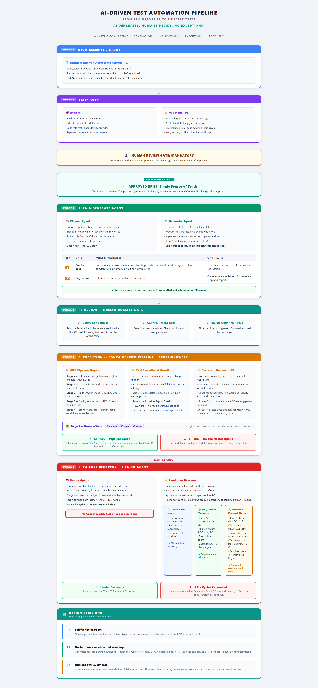

# Human-Governed AI Testing Pipeline

AI-assisted test automation for enterprise teams that need speed without losing control of test intent, review, and accountability.

## Core Idea

AI can generate tests quickly.

That is useful, but it is not enough.

In enterprise systems, the hard problem is not generating Playwright code. The hard problem is making sure generated tests continue to prove the right business behavior after requirements, planning, implementation, CI execution, and failure recovery.

This repository turns that idea into a practical reference workflow for Playwright, BDD, CI, and AI-assisted test generation.

This project documents a governed approach:

> AI generates. Humans decide. No exceptions.



## What This Repository Contains

This repository is a public reference model for an AI-assisted, human-governed testing workflow.

It includes:

- A long-form architecture article
- A sample approved brief
- A sample structured test plan
- A sample BDD feature file
- A sample Playwright configuration
- A sample CI workflow template
- A reusable checklist for reviewing AI-generated tests

The examples are intentionally generic and product-neutral. They are designed to show the workflow, not expose any private application logic.

## Pipeline Overview

```text
Requirements / Story
        |
        v
Brief
        |
        v
Human Review Gate
        |
        v
Approved Brief
        |
        v
Planner Agent
        |
        v
Generator Agent
        |
        v
Human PR Review
        |
        v
CI Execution
        |
        v
Failure Recovery
```

## Design Principles

### 1. The Brief Is the Contract

The approved brief locks test intent.

Downstream agents should read the approved brief, not reinterpret the original story or explore the UI to infer business meaning.

### 2. AI Accelerates Implementation, Not Accountability

AI can help plan scenarios, generate BDD, write Playwright code, and repair technical drift.

It should not decide what the product is supposed to do.

### 3. The Healer Fixes Execution, Not Meaning

Self-healing tests are useful only when they repair execution problems.

They become dangerous when they weaken assertions, remove coverage, or convert real product defects into passing tests.

### 4. Human Gates Are Mandatory

Humans review the brief.

Humans review the PR.

Humans decide whether a failing test represents a test issue, environment issue, requirement mismatch, or genuine product defect.

## Recommended Reading Order

1. [Architecture Article](docs/human-governed-ai-testing-pipeline.md)
2. [Sample Brief](examples/brief.sample.md)
3. [Sample Test Plan](examples/test-plan.sample.md)
4. [Sample Feature File](examples/dashboard-access.feature)
5. [AI Test Review Checklist](docs/ai-test-review-checklist.md)
6. [Sample GitHub Actions Workflow](examples/github-actions/playwright-sample.yml)
7. [Publishing Checklist](docs/publishing-checklist.md)

## Example Use Case

The sample artifacts model a generic dashboard access workflow:

- Viewer can open an existing dashboard
- Editor can create a dashboard
- Admin can manage dashboard permissions
- Unauthorized users do not see privileged actions

The point is not the dashboard itself.

The point is the governance workflow around requirement interpretation, test generation, review, and recovery.

## Who This Is For

This reference is intended for:

- QA architects
- Test automation engineers
- Engineering managers
- Platform teams
- Teams migrating from Selenium to Playwright
- Teams experimenting with AI-assisted test generation
- Teams that need automation governance, not just test generation speed

## What This Is Not

This is not:

- A claim that AI should fully own testing
- A demo where an agent freely explores the UI and invents coverage
- A replacement for product and QA review
- A generic starter framework for every test project

It is a reference workflow for building AI-assisted automation with explicit human control points.

## Status

This is an evolving reference model.

The first version focuses on the architecture and governance workflow. Future versions may include a fuller Playwright BDD skeleton, prompt templates, and CI examples.
